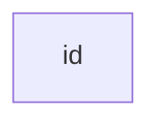

## code-fences to syntax highlight

````md
```ts
const x = 1;
```
````

```ts
const x = 1;
```

## inline code

```md
`test`
```

`test`

## code-fences to diagram

````md

````


## code-fences extra

````md
```some thing else
extra
```
````

```some thing else
extra
```
